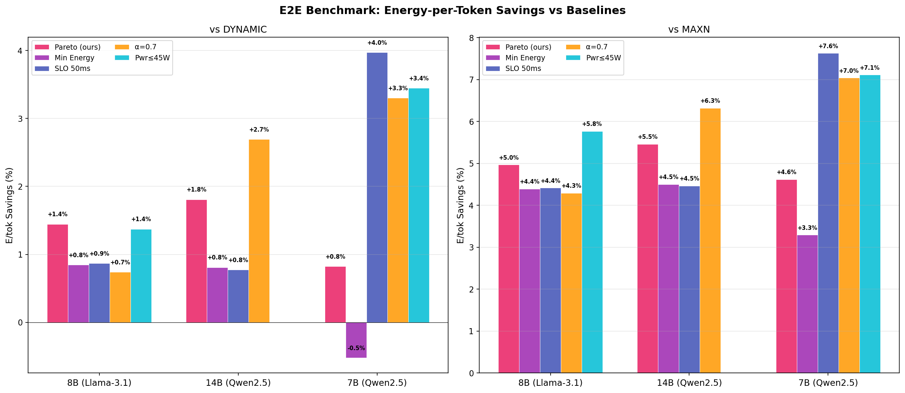
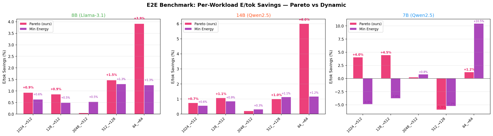
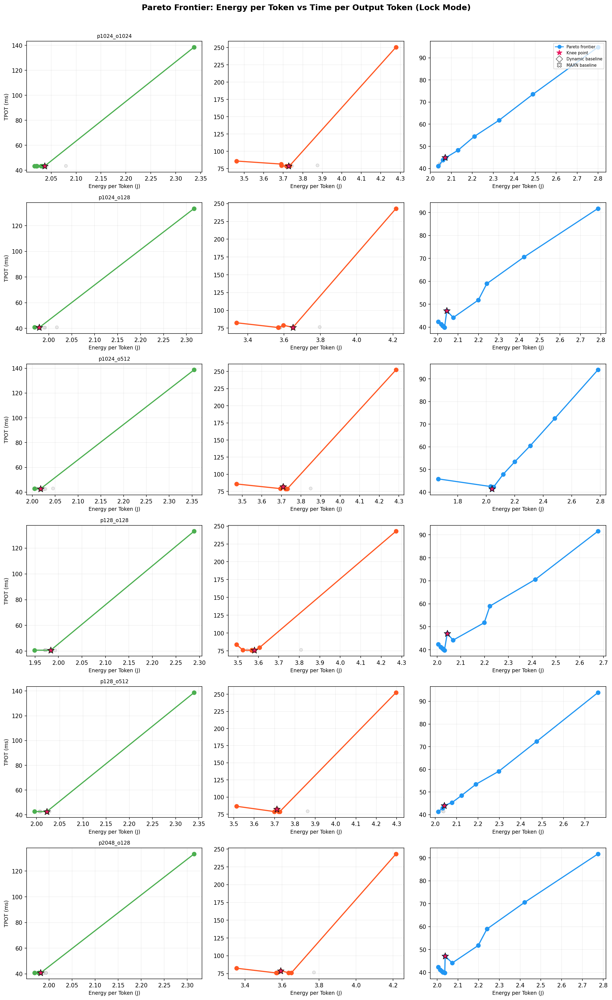
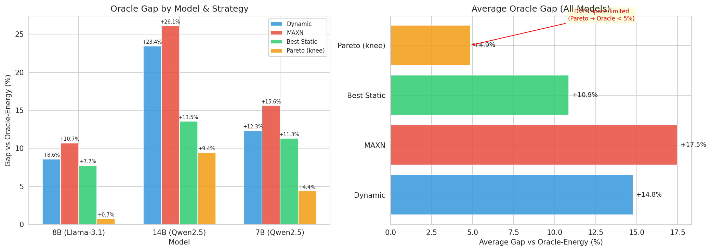
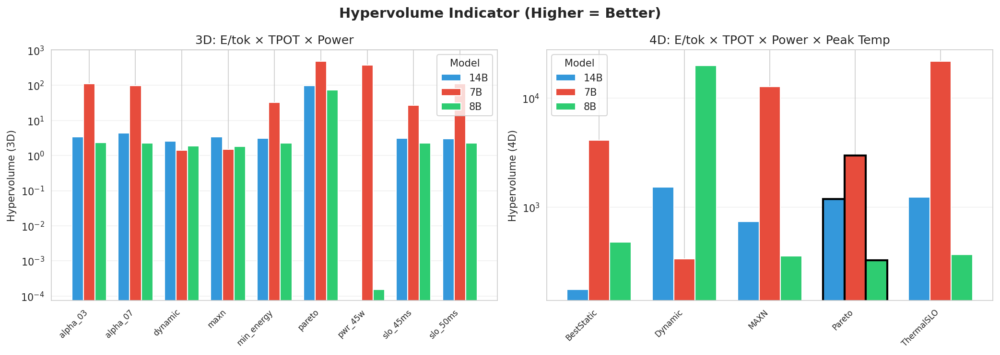

# 实验总览：Jetson 边端 GPU LLM 推理能耗分析

## 实验体系导航

本研究从基础能耗画像逐步演进到多目标 DVFS 选择器与长期 serving 验证，全部实验按时间线组织如下：

| 时期 | 实验 / 报告 | 规模 | 结果入口 |
|------|------------|------|---------|
| 早期验证 | [实验 1：混合阶段能耗分析](实验1-混合阶段能耗分析.md) | 180 runs | ⚠️ 结论已被实验 3 修正 |
| 早期验证 | [实验 2：分阶段能耗分析](实验2-分阶段能耗分析.md) | 360 runs | ⚠️ 结论已被实验 3 修正 |
| 早期验证 | [实验 3：扩展负载汇率表](实验3-扩展负载汇率表.md) | 672 runs | 基准汇率表 + DVFS 规则（有效） |
| 前置验证 | 前置验证实验（测量稳定性/旋钮敏感度/切换开销/SLO 等 7 项，合成负载） | — | [图表](../../figures/experiments_4_1_to_4_7/summary_dashboard.png)，数据报告 `data/experiments_4_1_to_4_7/` |
| 细粒度建模 | [实验 4：细粒度 GPU×EMC 能耗建模](实验4-细粒度GPUxEMC能耗建模.md) | 11 GPU × 4 EMC profiling | 三维汇率表 + alpha 选择器 |
| 细粒度建模 | [E2E 收益归因分析](E2E收益归因分析.md) | 225-run E2E | E2E 收益较弱的原因归因 |
| 方向转折 | 在线 phase 切换验证（负结果） | — | 切换开销 ~715ms（占 TTFT 37-65%），据此转向 cap 路线 |
| 大模型 profiling | 跨模型 profiling（7B/8B/14B） | — | [跨模型对比图](../../figures/cross_model_comparison/cross_model_gpu_freq_effect.png) |
| 选择器体系 | workload-aware 汇率表与多目标 Pareto | — | [Pareto 图表](../../figures/pareto_frontier/pareto_2d_ept_vs_tpot.png) |
| E2E 验证 | E2E 基准验证 | 378 runs (3 模型 × 9 策略) | [E2E 报告](../../figures/e2e_benchmark/e2e_benchmark_report.md) |
| 长期验证 | Oracle gap 与长期 serving 验证 | — | [分析图表](../../figures/phase13_analysis/serving_summary_dashboard.png) |
| 文献定位 | [相关工作对比](related_work_comparison.md) | — | DVFS / Serving / 边缘部署 / 多目标 |

## 实验环境

| 项目 | 规格 |
|------|------|
| **硬件** | Jetson AGX Orin (aarch64) |
| **GPU** | NVIDIA Ampere GA10B, 1024 CUDA cores, compute capability 8.7 |
| **内存** | 64GB LPDDR5, 统一内存架构 (GPU/CPU 共享) |
| **JetPack** | R36.4.4 (CUDA 12.6) |
| **内核** | Linux 5.15.148-tegra |
| **模型（实验 1-3）** | Phi-3-mini-4k-instruct (3.8B 参数) |
| **模型（后续阶段）** | Qwen2.5-7B / Meta-Llama-3.1-8B / Qwen2.5-14B |
| **量化** | Q4_K_M (GGUF) |
| **推理引擎** | llama-cpp-python 0.3.23 (CUDA 后端) |
| **GPU offload** | 全部层 (n_gpu_layers=-1) |
| **n_threads** | 4 |

## 频率配置空间

### 可调控钮

| 旋钮 | 范围 | 实验取值 | sysfs 接口 |
|------|------|---------|-----------|
| **GPU 频率** | 306-1300 MHz (11档) | 306, 612, 918, 1300 | devfreq max_freq/min_freq |
| **CPU 频率** | 115-2201 MHz (29档) | 1036, 1497, 2201 | cpufreq scaling_max/min_freq |
| **EMC 频率** | 无独立 sysfs 接口 | 通过 nvpmodel 间接控制 | /sys/kernel/nvpmodel_clk_cap/emc |

### Jetson 官方电源档位

| 档位 | nvpmodel | GPU 上限 | CPU 上限 | 核数 | 功耗目标 |
|------|:---:|---------:|---------:|:---:|:---:|
| MAXN | 0 | 1300 MHz | 2201 MHz | 12 | 无限制 |
| 50W | 3 | 816 MHz | 1497 MHz | 12 | 50W |
| 30W (出厂默认) | 2 | 612 MHz | 1728 MHz | 8 | 30W |
| 15W | 1 | 408 MHz | 1113 MHz | 4 | 15W |

## 功耗采集

| 项目 | 说明 |
|------|------|
| **工具** | tegrastats (JetPack 内置, 无需 sudo) |
| **采样间隔** | 500ms |
| **功耗域** | VDD_GPU_SOC (GPU), VDD_CPU_CV (CPU), VIN_SYS_5V0 (系统) |
| **温度域** | cpu@, tj@, soc0-2@ |
| **能耗计算** | total_energy_j = avg_power_w × duration_s |
| **派生指标** | energy_per_token_j, tokens_per_joule |

## 实验演进（早期验证）

### 实验 1：混合阶段能耗分析 (mixed-phase)

**目的**：建立 GPU × CPU 频率组合下的完整能耗画像

**矩阵**：4 GPU × 3 CPU × 5 workload × 3 repeat = 180 runs

| Workload | Prompt Length | Output Length | 场景 |
|----------|:---:|:---:|------|
| short_short | 128 | 64 | 短输入短输出 |
| short_long | 128 | 256 | 短输入长输出 |
| medium_medium | 512 | 128 | 中等均衡 |
| long_medium | 1024 | 128 | 长输入短输出 |
| long_long | 1024 | 512 | 长输入长输出 |

**结果文档**：[实验1-混合阶段能耗分析.md](实验1-混合阶段能耗分析.md)

### 实验 2：分阶段能耗分析 (per-phase)

**目的**：验证 prefill 和 decode 阶段的最优 GPU 频率是否不同

**矩阵**：4 GPU × 3 CPU × 5 workload × 2 phase × 3 repeat = 360 runs

| Phase | 实现方式 | 测量重点 |
|-------|---------|---------|
| prefill_only | output_length=1, 测量 TTFT | GPU 计算密集性 |
| decode_only | prompt_length=16, 测量 TPOT | GPU memory-bound 特性 |

**结果文档**：[实验2-分阶段能耗分析.md](实验2-分阶段能耗分析.md)

### 实验 3：扩展负载汇率表（2026-05-15）

**目的**：用修正后的 `performance` governor 重新收集 14 种负载下的能耗数据，构建可靠的汇率表

**矩阵**：4 GPU × 2 CPU × 14 workloads × 2 phases × 3 repeats = 672 runs

**关键修正**：发现并修复了 GPU `userspace` governor bug（推理负载下 GPU 跳频至 1300MHz），改用 `performance` governor

**核心发现**：
- GPU 频率对性能有显著影响（306→918 MHz：TPS 提升 2.5×）
- GPU 918MHz 在 10/14 个负载中为最优配置
- 构建了 28 个 workload×phase 桶的完整汇率表和 DVFS 规则

**数据文件**：`data/energy_profiling/expanded_profiling_20260515_031015.csv`（原始数据仅本地保留，可由 `src/experiments/run_expanded_profiling.py` 重新生成）
**汇率表**：`data/rate_tables/dvfs_rules_20260515_045753.json`（原始数据仅本地保留）
**结果文档**：[实验3-扩展负载汇率表](实验3-扩展负载汇率表.md)

## 实验演进（细粒度建模与选择器体系）

### 前置验证实验（7 项，合成负载）

在进入真实模型实验前，用合成负载框架完成 7 项前置验证：测量稳定性（4.1）、单旋钮敏感度（4.2）、频率组合交互（4.3）、prefill/decode 差异（4.4）、负载可预测性（4.5）、切换开销（4.6）、SLO 端到端验证（4.7）。

- **总览图**：[summary_dashboard](../../figures/experiments_4_1_to_4_7/summary_dashboard.png)（各实验图见同目录）
- **数据报告**：`data/experiments_4_1_to_4_7/`（txt 报告随仓库发布，原始数据仅本地）

### 实验 4：细粒度 GPU×EMC 能耗建模

将频率空间从 4 GPU 档扩展到 11 GPU × 4 EMC 细粒度组合，构建 GPU×EMC×CPU 三维能耗汇率表，并引入 alpha 权重选择器与 225-run E2E 验证。EMC 经 DebugFS 控制。

- **实验报告**：[实验4-细粒度GPUxEMC能耗建模.md](实验4-细粒度GPUxEMC能耗建模.md)
- **分析总结**：[E2E 收益归因分析](E2E收益归因分析.md)（E2E 收益较弱的原因归因）
- **图表**：`figures/finegrained_profiling/`、`figures/e2e_benchmark_finegrained/`

### 在线 phase 切换验证（负结果）

实测 sysfs 层面 prefill→decode 边界强制切换的开销约 715ms（占 TTFT 的 37-65%），单请求内 true phase-switching 不可行。**据此主线转向"离线 lock 频率 profiling + 在线 workload-aware 频率 cap"**。

### 三模式控制、benchmark 模式与跨模型 profiling

频率控制重构为 Lock / Cap / Dynamic 三模式；benchmark 模式引入 EOS 抑制保证完整输出；完成 7B / 8B / 14B 三个真实模型的 profiling。

- **图表**：`figures/cross_model_comparison/`、`figures/14b_profiling/`

### workload-aware 汇率表与多目标 Pareto 选择器

汇率表升级为 workload-aware（按 prompt × output 长度分桶），选择器从单一最优解升级为 E/tok × TPOT × Power 三目标 Pareto 前沿 + knee point / SLO 约束 / alpha 连续调节三种选取策略。

- **图表**：`figures/pareto_frontier/`

### E2E 基准验证（378 runs）

3 模型 × 9 策略 × 多 workload 的端到端验证：Pareto 策略在 7B 上实现功率 -18.6%（vs Dynamic）、E/tok +4.5%（vs MAXN），且各策略行为差异显著。

- **报告**：[e2e_benchmark_report.md](../../figures/e2e_benchmark/e2e_benchmark_report.md)
- **图表**：`figures/e2e_benchmark/`

### Oracle gap 分析与长期 serving 验证

量化选择器距 oracle 理论最优的剩余空间（Pareto 距上界仅 +4.9%）；新增 6 级优先级的 Thermal-SLO 反馈控制器（温度/SLO/功率，10s 窗口）；完成长期 serving benchmark 与 EMO 多目标评估（MDR/JIR/HV）。

- **图表**：`figures/phase13_analysis/`
- **报告**：`data/oracle_gap_analysis/`、`data/multi_obj_eval/`（md 报告随仓库发布）

## 关键结果一图流











> 完整图表见 [figures/](../../figures/) 各子目录；数值结论汇总见主 [README](../../README.md) 的"E2E 实测结果"一节。

## 重要历史说明

> **2026-05-15 修正 (GPU Governor Bug)**：实验 1 和实验 2 使用的 `userspace` GPU governor
> 无法在推理负载下锁定频率，GPU 会自发跳频至 1300MHz。这导致所有 "GPU 频率无影响" 和
> "GPU 612MHz 饱和" 的结论是错误的。实验 3 使用 `performance` governor 重新收集数据，
> 证实 GPU 频率确实影响性能（306→918 MHz：2.5× TPS 提升）。

> **2026-05-14 修正**：前期实验 (2026-05-13) 使用的 llama-cpp-python 未编译 CUDA 支持，
> 所有推理实际运行在 CPU 上 (`llama_supports_gpu_offload() = False`)。
> 该问题已修复，后续所有实验均使用 CUDA GPU offload。
> CPU-only 实验数据已归档（仅本地保留）作为对比参考。

## 文档结构

```
docs/实验文档/
├── README.md                            ← 文档索引 + 术语规范 + 核心结论
├── 实验总览.md                           ← 本文档：环境、设计、术语
├── 实验1-混合阶段能耗分析.md
├── 实验2-分阶段能耗分析.md
├── 实验3-扩展负载汇率表.md
├── 实验4-细粒度GPUxEMC能耗建模.md
├── E2E收益归因分析.md
└── related_work_comparison.md
```
